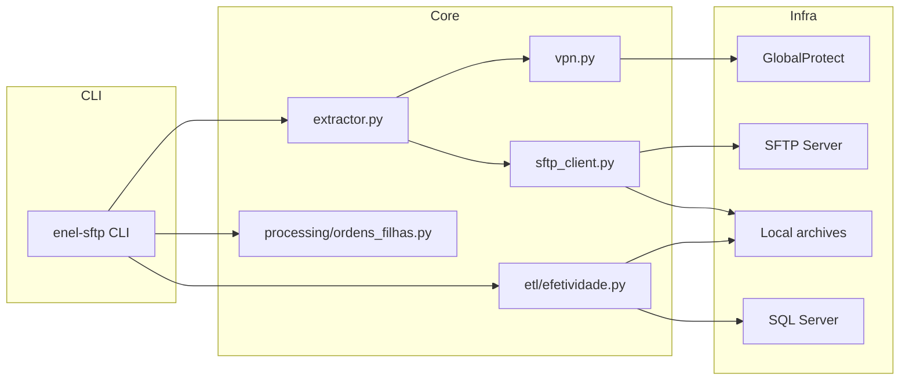
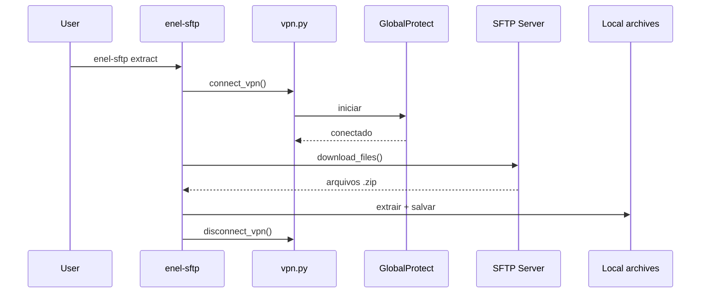
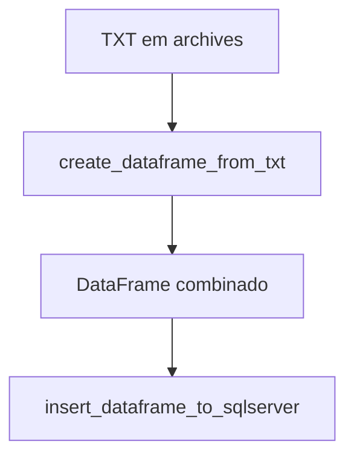

# Extract ENEL SFTP

Automacao para baixar arquivos operacionais via SFTP (ambiente ENEL), extrair ZIPs e, quando necessario, processar a Efetividade de Leitura para carga em SQL Server.

## Arquitetura

### Componentes e fluxo principal



### Sequencia de extracao SFTP



### Pipeline de ETL (Efetividade)



## Estrutura do Projeto

```text
extract-enel-sftp/
├── src/
│   └── extract_enel_sftp/
│       ├── cli.py
│       ├── config.py
│       ├── extractor.py
│       ├── logging_config.py
│       ├── sftp_client.py
│       ├── vpn.py
│       ├── etl/
│       │   └── efetividade.py
│       ├── processing/
│       │   └── ordens_filhas.py
│       └── tools/
│           ├── sftp_password.py
│           └── sftp_password_regex.py
├── sftp_extractor.py
├── dataframe_efetividade_da_leitura.py
├── Base_mes_Efetividade.py
├── sftp_teste.py
├── sftp_teste_2.py
├── pyproject.toml
└── README.md
```

## Requisitos

- Python 3.9+
- Acesso a VPN da ENEL
- GlobalProtect instalado (PanGPA.exe) para uso da conexao automatica no Windows
- Chaves SSH OpenSSH sem senha (passphrase nao suportada no script)
- ODBC Driver 18 for SQL Server

## Instalacao (Poetry)

```bash
poetry install
```

Para criar a virtualenv dentro do projeto:

```bash
POETRY_VIRTUALENVS_IN_PROJECT=1 poetry install
```

## Uso

Extracao principal:

```bash
poetry run enel-sftp extract
```

ETL Efetividade:

```bash
poetry run enel-sftp etl
```

Processar ordens filhas:

```bash
poetry run enel-sftp ordens-filhas --arquivo archives/COELCE_elaazisysd00_ordemfilhas.txt
```

Testes SFTP por prefixo e mes:

```bash
poetry run enel-sftp test-sftp --file-prefix BaseMes --file-month 202602
poetry run enel-sftp test-sftp-regex --file-prefix BaseMes --file-month 202601
```

Scripts legados continuam disponiveis como wrappers (recomendado usar o CLI via Poetry):

```bash
python sftp_extractor.py
python dataframe_efetividade_da_leitura.py
python sftp_teste.py
python sftp_teste_2.py
```

## Configuracao por variaveis de ambiente

As configuracoes padrao ficam em `src/extract_enel_sftp/config.py`. Para sobrescrever:

### Extracao SFTP

- `ENEL_VPN_PORTAL`
- `ENEL_GLOBALPROTECT_PATH`
- `ENEL_KEYS_BASE_PATH`
- `ENEL_HOST_CE`
- `ENEL_HOST_CE_USER`
- `ENEL_REMOTE_PATH`
- `ENEL_DOWNLOAD_BASE_DIR`

### Efetividade SQL Server

- `ENEL_EFETIVIDADE_DIR`
- `ENEL_SQL_SERVER_USER`
- `ENEL_SQL_SERVER_PASSWORD`
- `ENEL_SQL_SERVER_HOST`
- `ENEL_SQL_SERVER_PORT`
- `ENEL_SQL_SERVER_DB`
- `ENEL_SQL_SERVER_TABLE`

### Testes SFTP por senha

- `ENEL_TEST_SFTP_HOST`
- `ENEL_TEST_SFTP_PORT`
- `ENEL_TEST_SFTP_USER`
- `ENEL_TEST_SFTP_PASSWORD`
- `ENEL_TEST_SFTP_REMOTE_PATH`
- `ENEL_TEST_FILE_PREFIX`
- `ENEL_TEST_FILE_MONTH`
- `ENEL_TEST_DOWNLOAD_BASE_DIR`

## Observacoes

- O fluxo principal foi desenhado para Windows (checagem da VPN e caminho do GlobalProtect). Em outros sistemas, conecte a VPN manualmente e ajuste o script.
- Credenciais de banco e SFTP estao hardcoded por padrao. Recomenda-se mover para variaveis de ambiente ou vault.
- Caminhos de rede e IPs sao internos. Garanta acesso antes de executar.
